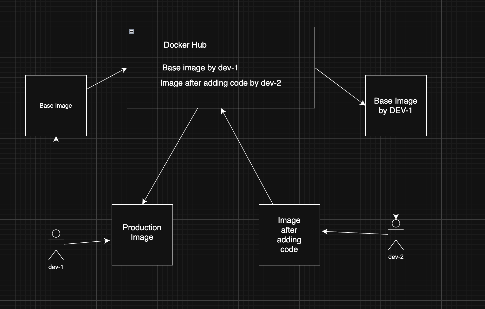

# 🚀 Dockerized Apache Deployment – Case Study

## 📌 Problem Statement

You are a DevOps Engineer tasked with Dockerizing a custom application for production.

### Assumptions

- Software: **Apache**
- Base OS: **Ubuntu**
- No pre-built image available

### Requirements

1. Create and push a base image (Ubuntu + Apache) to Docker Hub
2. Developers should only provide code (no Docker knowledge required)
3. Provide a Dockerfile for developers to build their application image

---

## 🏗️ Architecture Overview



### 🔄 Flow Explanation

1. **DevOps Engineer**
   - Builds a reusable **base image** (Ubuntu + Apache)
   - Pushes it to Docker Hub

2. **Docker Hub**
   - Acts as a central registry
   - Stores:
     - Base Image
     - Application Image (after developer adds code)

3. **Developer**
   - Pulls the base image
   - Adds application code
   - Builds final application image

4. **Production Environment**
   - Pulls the final image
   - Runs the containerized application

---

## 📁 Project Structure

```bash
case-study/
├── Dockerfile.base
├── README.md
├── architecture.png
└── developer/
    ├── Dockerfile
    └── index.html
```

---

## 🧱 Base Image (DevOps Layer)

### Dockerfile: `Dockerfile.base`

```dockerfile
FROM ubuntu:22.04

ENV DEBIAN_FRONTEND=noninteractive

RUN apt-get update && \
    apt-get install -y apache2 && \
    rm -rf /var/lib/apt/lists/*

EXPOSE 80

CMD ["apachectl", "-D", "FOREGROUND"]
```

### 🔨 Build Base Image

```bash
docker build -f Dockerfile.base -t yourrepo/ubuntu-apache-base:1.0 .
```

### 📤 Push to Docker Hub

```bash
docker login
docker push yourrepo/ubuntu-apache-base:1.0
```

---

## 👨‍💻 Application Image (Developer Layer)

### Dockerfile: `developer/Dockerfile`

```dockerfile
FROM yourrepo/ubuntu-apache-base:1.0

COPY . /var/www/html/

EXPOSE 80

CMD ["apachectl", "-D", "FOREGROUND"]
```

### 📄 Sample Application

Developers only need to provide their application files (e.g., `index.html`).
These files will automatically replace the default Apache page.

---

## 🔨 Build Application Image

```bash
cd developer
docker build -t yourrepo/custom-apache-app:1.0 .
```

### 📤 Push Final Image

```bash
docker push yourrepo/custom-apache-app:1.0
```

---

## 🚀 Run in Production

```bash
docker run -d --name apache-app -p 80:80 yourrepo/custom-apache-app:1.0
```

Open in browser:

```
http://localhost
```

---

## ✅ Key Benefits

- 🔁 Reusable base image across teams
- 👨‍💻 Developers focus only on application code
- 📦 Consistent and standardized environments
- 🚀 Faster and simpler deployments
- 🔒 Secure and isolated execution using containers

---

## 🧠 DevOps Insight

This architecture follows:

> **"Build once, reuse everywhere"**

- Base Image → Platform Layer
- Application Image → Business Logic Layer

---

## 🏁 Conclusion

A reusable Ubuntu + Apache base image is created and pushed to Docker Hub.
Developers build on top of this image by simply adding their code.

This approach ensures:

- consistency across environments
- reduced developer overhead
- scalable and production-ready deployments

---

## ⚡ Author

**Anubhav Sharma**
DevOps & Cloud Engineer
